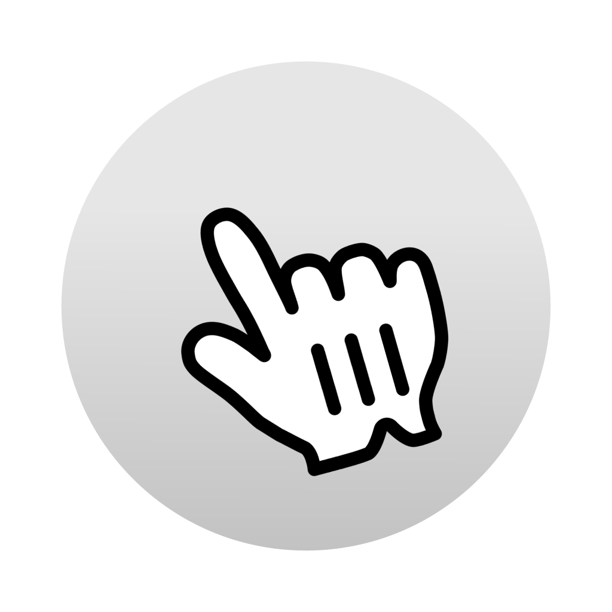
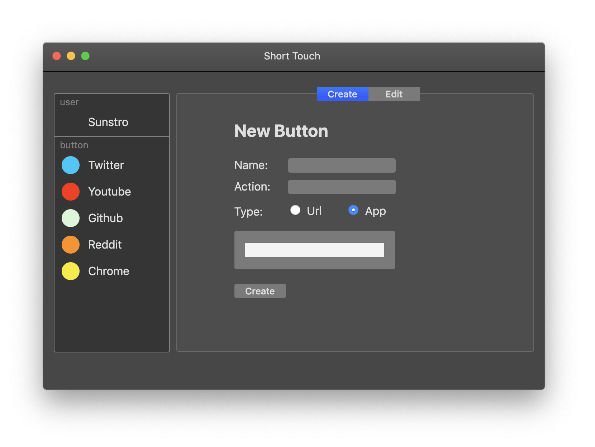
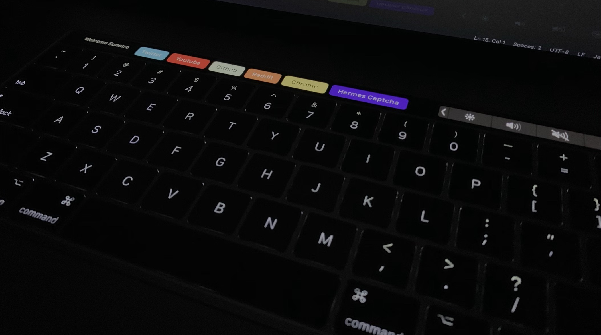

# Short Touch β 

> Application to easily generate short cut buttons on MacBooks with the touch bar.

<a href="https://github.com/SunstroUS/short-touch/releases">
	
</a>

<a href="https://github.com/SunstroUS/short-touch/releases">
	
</a>

## What can it do

Short Touch allows you to have 6 shortcuts on your touch bar that are somewhat easily accessible at the click of a button. Unfortunately, there are some limitations of the the touch bar api, such as the fact that it's only present whilethe app is open. It acts more of a quick launcher rather than a permanent solution for your TB. Right now support URLs to open in safari, and opening apps. I would like to add support for opening links inside other browsers (Chrome, Firefox).

## Install

\*Currently this is still in beta/development and can only be installed by cloning the repo and manually installing it.

Make sure you have [Node.js](http://nodejs.org/) installed.

```sh
> git clone https://github.com/SunstroUS/short-touch.git
> cd short-touch
> npm install
> npm run start
```

## Features

- 6 custom short cuts
- Native macOS appearance
- Can open URLs (in safari)
- Can open applications
- Open Source and always free

## Creating a new short touch

#### For Applications

You must start the input with '/Applications/'

example: '/Applications/Google Chrome.app'

#### For URLs

You must start the input with 'http://' or 'https://'

example: 'https://www.github.com/sunstrous'

## Dev

Built with [Electron](https://electronjs.org).

## Inspired by

- [Caprine](https://github.com/sindresorhus/caprine) by [Sindre Sorhus](https://github.com/sindresorhus)
- [Inboxer](https://github.com/denysdovhan/inboxer) by [Denys Dovhan](https://github.com/denysdovhan)
